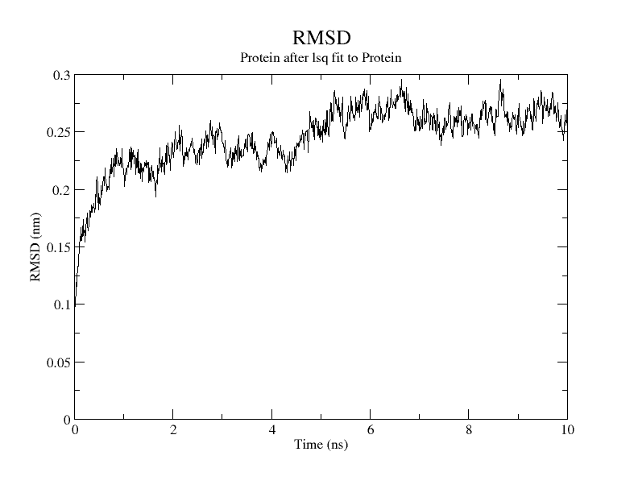
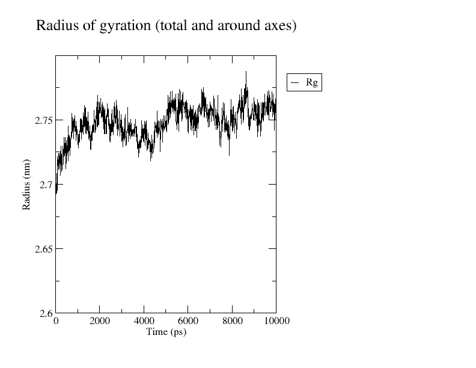

# Human DPP-4 Molecular Dynamics Simulation

## Overview

This repository documents a molecular dynamics simulation of the extracellular domain of human dipeptidyl peptidase-4 (DPP-4) using GROMACS.

The protein was prepared as a solvated system and simulated in explicit SPC/E water using the OPLS-AA force field.

## System

- **Protein:** Human dipeptidyl peptidase-4 (DPP-4)
- **Protein residues:** 39–766
- **Force field:** OPLS-AA
- **Water model:** SPC/E
- **Simulation software:** GROMACS
- **Temperature:** 300 K
- **Pressure:** 1 bar

## Molecular Dynamics Workflow

1. Protein structure preparation
2. Topology generation
3. Simulation box generation
4. Solvation with explicit water
5. Ion addition
6. Energy minimization
7. NVT equilibration
8. NPT equilibration
9. Production molecular dynamics
10. Trajectory analysis

## Production Molecular Dynamics

- **Integrator:** Leap-frog
- **Time step:** 2 fs
- **Number of steps:** 5,000,000
- **Production duration:** 10 ns
- **Temperature coupling:** V-rescale
- **Reference temperature:** 300 K
- **Pressure coupling:** Parrinello–Rahman
- **Reference pressure:** 1 bar
- **Pressure coupling type:** Isotropic
- **Coordinates saved:** Every 10 ps
- **Energy data saved:** Every 10 ps

## Repository Structure

```text
human-dpp4-md-gromacs/
│
├── README.md
│
├── structure/
│   └── protein.pdb
│
├── topology/
│   └── topol.top
│
├── mdp/
│   ├── em.mdp
│   ├── ions.mdp
│   ├── nvt.mdp
│   ├── npt.mdp
│   └── md.mdp
│
├── system/
│   ├── protein_processed.gro
│   ├── protein_box.gro
│   ├── protein_solvate.gro
│   └── protein_ion.gro
│
└── analysis/
    └── graphs/
        ├── rmsd.xvg
        ├── rmsd_plot.png
        ├── gyrate.xvg
        ├── Rg_plot.png
        ├── density.xvg
        ├── density.png
        ├── density_full.xvg
        ├── potential.xvg
        ├── potential_m.png
        ├── potential_full.xvg
        ├── pressure.xvg
        ├── pressure.png
        ├── pressure_full.xvg
        ├── temperature.xvg
        ├── temperature.png
        └── temperature_full.xvg
```
## Results and Analysis

The molecular dynamics trajectory was analyzed using root-mean-square deviation (RMSD) and radius of gyration (Rg).

### Root-Mean-Square Deviation (RMSD)

- Average RMSD: **0.244 nm**
- RMSD range: **0.001–0.295 nm**

The RMSD describes the structural deviation of the protein relative to the reference structure during the simulation. The trajectory showed fluctuations within the observed range.



### Radius of Gyration (Rg)

- Average Rg: **2.745 nm**
- Rg range: **2.674–2.788 nm**

The radius of gyration describes the overall compactness of the protein. The relatively narrow range observed during the simulation indicates that the overall size and compactness of the protein remained within a limited range.



### Production Energy Analysis

Additional energy and system-property analyses were extracted directly from the production molecular dynamics energy file (`md.edr`) covering the complete 10 ns trajectory.

- **Average temperature:** **300.03 K**
- **Average pressure:** **0.925 bar**
- **Average density:** **1034.27 kg/m³**
- **Average potential energy:** **−1.32227 × 10⁶ kJ/mol**

The temperature remained centered around the target temperature of 300 K. The average pressure was close to the reference pressure of 1 bar, while density fluctuated around an average of 1034.27 kg/m³.

The full production analysis files are provided as `.xvg` files in `analysis/graphs/`.
